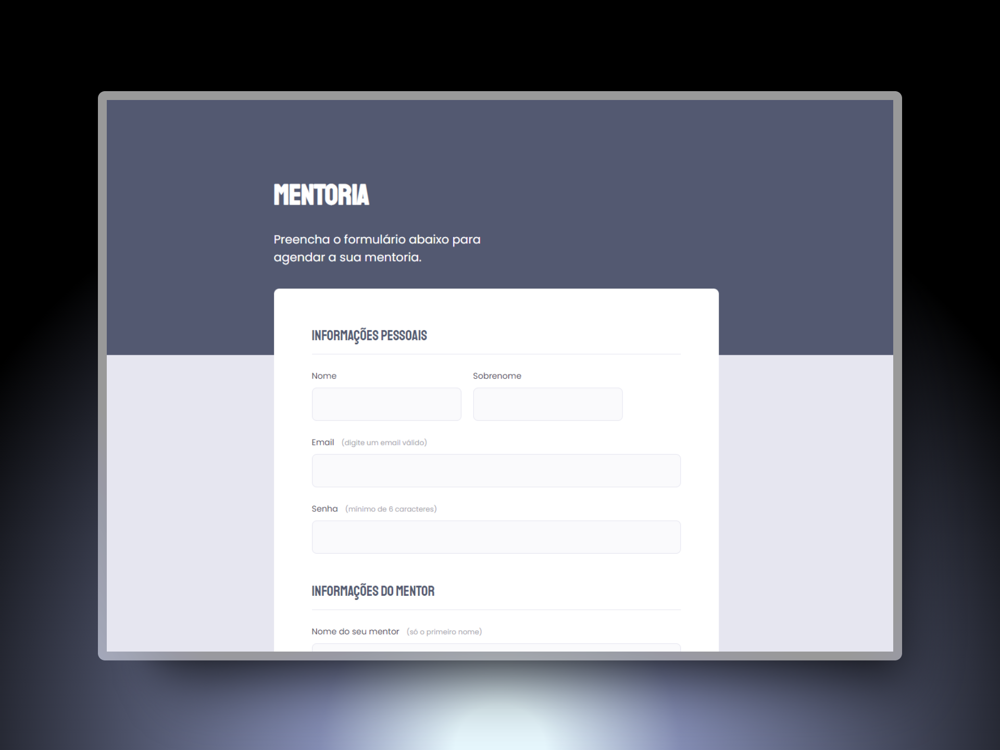

<h1 align="center"> Mentoria </h1>

  <a href="#-tecnologias">Tecnologias</a>&nbsp;&nbsp;&nbsp;|&nbsp;&nbsp;&nbsp;
  <a href="#-projeto">Projeto</a>&nbsp;&nbsp;&nbsp;|&nbsp;&nbsp;&nbsp;
  <a href="#-layout">Layout</a>&nbsp;&nbsp;&nbsp;&nbsp;&nbsp;&nbsp;

 

  

## 🚀 Tecnologias

Esse projeto foi desenvolvido com as seguintes tecnologias:

- HTML e CSS
- Git e Github
- Figma

## 💻 Projeto

Neste projeto Rocketseat foi feito um formulário com o tema "Mentoria" para desktop, com o intuito de estudar fundamentos sobre formulários, validações e customização com html e css, onde, foi desafiado a reprodução de um layout pelo figma com os conceitos aprendidos em aula. Espero que gostem!

- [Acesse o projeto finalizado, online](https://luriserdan.github.io/mentoria-form/)

## 🔖 Layout

Você pode visualizar o layout do projeto através [DESSE LINK](https://www.figma.com/design/jedzipbPbU96c8otOQikQ4/Stage-03---Formul%C3%A1rio-intermedi%C3%A1rio-(Copy)?node-id=3-4&t=2FNpCRh1zORv2zVs-0). É necessário ter conta no [Figma](https://figma.com) para acessá-lo.

Feito com ♥ by Luri Serdan